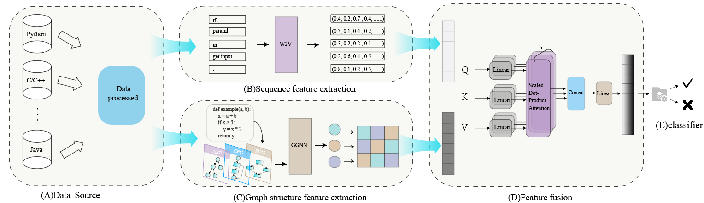

# VDMAF: Cross-language Source Code Vulnerability Detection Using Multi-head Attention Fusion


This repository provides an implementation of the method proposed in the paper “VDMAF: cross-language source code vulnerability detection using multi-head attention fusion”. For more information on data preprocessing, experimental design, and analysis of results, please refer to the relevant chapters in the paper for a more comprehensive understanding of the background and technical details of this research.
  dio: https://doi.org/10.1016/j.infsof.2025.107739

# Approach



## Access to datasets

Devign [1]: https://drive.google.com/file/d/1-19rjVwaZr31Ow1raUTa4mijJr7dJdVt/view?usp=sharing

Reveal [2]: https://drive.google.com/file/d/1ul89IIvSsYcrYDE8uczJ2zsMnEL1rc1_/view?usp=sharing

Bagheri [3]: https://drive.google.com/file/d/1OrPsAxdIZ_6jWBmDyJYaSIoe9hNlR6YN/view?usp=sharing

## Figure

We put the images involved in the paper in the folder `fig\` 

## Install dependencies

Please install them first.

```
unzip VDMAF-main.zip
cd VDMAF_main
conda create -n vdmaf python=3.9 
conda activate vdmaf
pip install -r requirements.txt
```
## About the Models

In the replication, we provide:

* `train_w2vmodel.py` : Used to train word embeddings
* `get_corpus.py` : Used to generate a corpus
* `makemodel.py` : Used to train models
* `myutils.py` : Toolkit for training models
* `./model` : Used to store trained models
* `./dataset` : Used to store downloaded datasets

## References

[1] Yaqin Zhou, Shangqing Liu, Jingkai Siow, Xiaoning Du, and Yang Liu. Devign: Effective vulnerability identification by learning comprehensive program semantics via graph neural networks. *Advances* *in neural information processing systems*, 32, 2019. https://doi.org/10.48550/arXiv.1909.03496.

[2] Saikat Chakraborty, Rahul Krishna, Yangruibo Ding, and Baishakhi Ray. Deep learning based vulnerability detection: Are we there yet? *IEEE Transactions on Software Engineering*, 48(9):3280–3296, 2021. https://ieeexplore.ieee.org/document/9448435/

[3] Laura Wartschinski, Yannic Noller, Thomas Vogel, Timo Kehrer, and Lars Grunske. Vudenc: vulnerability detection with deep learning on a natural codebase for python. *Information and Software Technology*, 144:106809, 2022. https://doi.org/10.1016/j.infsof.2021.106809.

## 许可协议
本项目采用 [CC BY 4.0](https://creativecommons.org/licenses/by/4.0/deed.zh) 许可协议。

